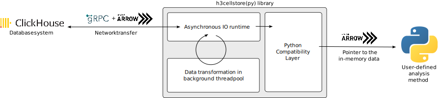

#  ukis_h3cellstore

Python bindings to integrate ClickHouse H3 databases with the Python data science world.

Schematic of the read workflow:

## Contents

- [ukis_clickhouse_arrow_grpc](crates/ukis_clickhouse_arrow_grpc/README.md): GRPC-based interface library for ClickHouse using Arrow IPC as data exchange format
- [ukis_h3cellstore](crates/ukis_h3cellstore/README.md): High-level Rust crate to store H3 cells in ClickHouse databases
- [ukis_h3cellstorepy](crates/ukis_h3cellstorepy/README.md): High-level Python library to store H3 cells in ClickHouse databases

See `crates` subdirectory.

## Inner workings

### `Compacted tables` storage schema

## Development

### Launching a ClickHouse instance for the examples to work

See the `clickhouse` target in the [justfile](justfile).

## License
This software is licensed under the [Apache 2.0 License](https://github.com/dlr-eoc/ukis-h3cellstore/blob/master/LICENSE.txt).

Copyright (c) 2023 German Aerospace Center (DLR) * German Remote Sensing Data Center * Department: Geo-Risks and Civil Security

## Changelog
See [changelog](https://github.com/dlr-eoc/ukis-h3cellstore/blob/master/CHANGES.md).

## Contributing
The UKIS team welcomes contributions from the community.
For more detailed information, see our guide on [contributing](https://github.com/dlr-eoc/ukis-h3cellstore/blob/master/CONTRIBUTING.md) if you're interested in getting involved.

## What is UKIS?
The DLR project Environmental and Crisis Information System (the German abbreviation is UKIS, standing for [Umwelt- und Kriseninformationssysteme](https://www.dlr.de/eoc/en/desktopdefault.aspx/tabid-5413/10560_read-21914/)) aims at harmonizing the development of information systems at the German Remote Sensing Data Center (DFD) and setting up a framework of modularized and generalized software components.

UKIS is intended to ease and standardize the process of setting up specific information systems and thus bridging the gap from EO product generation and information fusion to the delivery of products and information to end users.

Furthermore, the intention is to save and broaden know-how that was and is invested and earned in the development of information systems and components in several ongoing and future DFD projects.
