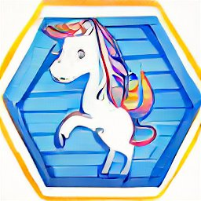

# h3cellstore

Python bindings to integrate clickhouse H3 databases with the python data-science world.

Schematic of the read-workflow:

## Contents

- [arrow_h3](crates/arrow_h3/README.md): H3-related algorithms on dataframes containing H3 cells
- [clickhouse_arrow_grpc](crates/clickhouse_arrow_grpc/README.md): GRPC-based interface library for ClickHouse using Arrow-IPC as data exchange format
- [h3cellstore](crates/h3cellstore/README.md): High-level rust crate to store H3 cells in ClickHouse databases
- [h3cellstorepy](crates/h3cellstorepy/README.md): High-level Python library to store H3 cells in ClickHouse databases

See `crates` subdirectory.

## Inner workings

### `Compacted tables` storage schema

## Development

### Launching a Clickhouse instance for the examples to work

see the `clickhouse` target in the [justfile](justfile).

The logo has been created with <a href="https://www.craiyon.com/">Craiyon</a> and the term "illustration of happy unicorn with rainbow-tail standing on a shipping container framed within hexagon".

